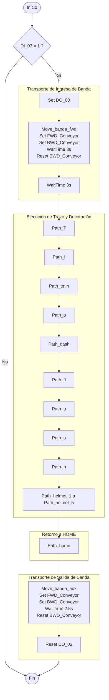

### Ciclo de decoración

[Volver a Informe](../README.MD)

```mermaid
flowchart TD
    A([Inicio]) --> B{"DI_03 = 1 ?"}
    B -- No --> Z([Fin])
    B -- Sí --> C["Set DO_03"]
    
    subgraph ETAPA1["Transporte de Ingreso de Banda"]
        C --> D["Move_banda_fwd<br/>Set FWD_Conveyor<br/>Set BWD_Conveyor<br/>WaitTime 3s<br/>Reset BWD_Conveyor"]
        D --> E["WaitTime 3s"]
    end

    subgraph ETAPA2["Ejecución de Trazo y Decoración"]
        E --> F["Path_T"]
        F --> G["Path_i"]
        G --> H["Path_tmin"]
        H --> I["Path_o"]
        I --> J["Path_dash"]
        J --> K["Path_J"]
        K --> L["Path_u"]
        L --> M["Path_a"]
        M --> N["Path_n"]
        N --> O["Path_helmet_1 a Path_helmet_5"]
    end

    subgraph ETAPA3["Retorno a HOME"]
        O --> P["Path_home"]
    end

    subgraph ETAPA4["Transporte de Salida de Banda"]
        P --> Q["Move_banda_aux<br/>Set FWD_Conveyor<br/>Set BWD_Conveyor<br/>WaitTime 2.5s<br/>Reset BWD_Conveyor"]
        Q --> R["Reset DO_03"]
    end

    R --> Z
```

[Volver a Informe](../README.MD)