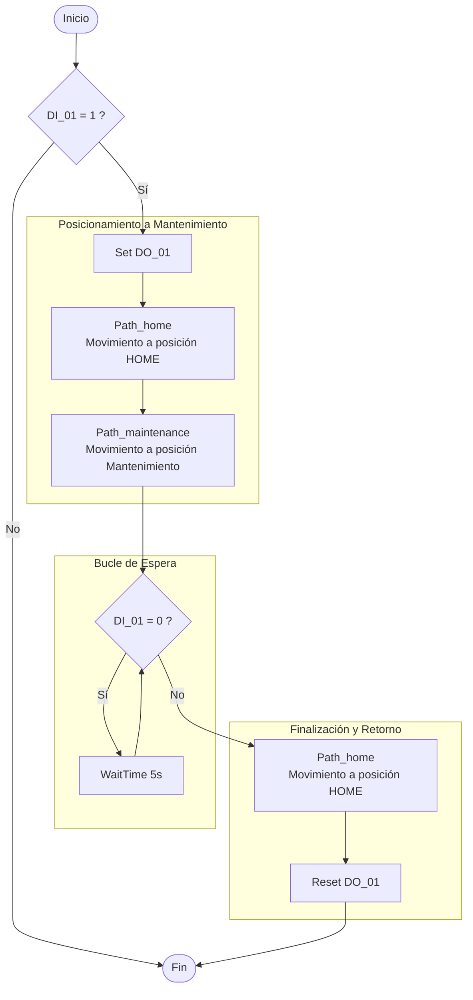

### Pose de mantenimiento

[Volver a Informe](../README.MD)

```mermaid
flowchart TD
    A([Inicio]) --> B{"DI_01 = 1 ?"}
    B -- No --> Z([Fin])
    B -- Sí --> C["Set DO_01"]
    
    subgraph POSICIONAMIENTO["Posicionamiento a Mantenimiento"]
        C --> D["Path_home<br/>Movimiento a posición HOME"]
        D --> E["Path_maintenance<br/>Movimiento a posición Mantenimiento"]
    end

    subgraph ESPERA["Bucle de Espera"]
        E --> F{"DI_01 = 0 ?"}
        F -- Sí --> G["WaitTime 5s"]
        G --> F
    end

    subgraph RETORNO["Finalización y Retorno"]
        F -- No --> H["Path_home<br/>Movimiento a posición HOME"]
        H --> I["Reset DO_01"]
    end

    I --> Z
```

[Volver a Informe](../README.MD)