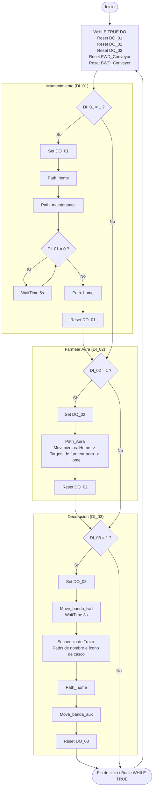

### Flujo general y resumen de Main

[Volver a Informe](../README.MD)

```mermaid
flowchart TD
    A([Inicio]) --> B["WHILE TRUE DO<br/>Reset DO_01<br/>Reset DO_02<br/>Reset DO_03<br/>Reset FWD_Conveyor<br/>Reset BWD_Conveyor"]
    
    B --> C{"DI_01 = 1 ?"}
    
    subgraph RUTINA1["Mantenimiento (DI_01)"]
        C -- Sí --> D["Set DO_01"]
        D --> D1["Path_home"]
        D1 --> D2["Path_maintenance"]
        D2 --> D3{"DI_01 = 0 ?"}
        D3 -- Sí --> D4["WaitTime 5s"]
        D4 --> D3
        D3 -- No --> D5["Path_home"]
        D5 --> D6["Reset DO_01"]
    end

    D6 --> E{"DI_02 = 1 ?"}
    C -- No --> E

    subgraph RUTINA2["Farmear Aura (DI_02)"]
        E -- Sí --> F["Set DO_02"]
        F --> F1["Path_Aura<br/>Movimientos: Home -> Targets de farmear aura -> Home"]
        F1 --> F2["Reset DO_02"]
    end

    F2 --> G{"DI_03 = 1 ?"}
    E -- No --> G

    subgraph RUTINA3["Decoración (DI_03)"]
        G -- Sí --> H["Set DO_03"]
        H --> H1["Move_banda_fwd<br/>WaitTime 3s"]
        H1 --> H2["Secuencia de Trazo:<br/>Paths de nombre e ícono de casco"]
        H2 --> H3["Path_home"]
        H3 --> H4["Move_banda_aux"]
        H4 --> H5["Reset DO_03"]
    end

    H5 --> I([Fin de ciclo / Bucle WHILE TRUE])
    G -- No --> I
    
    I --> B
```

[Volver a Informe](../README.MD)